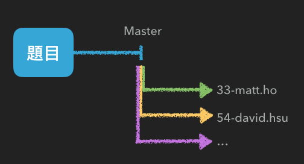

# SoftLeader developer assessment tests

> 松凌科技工程師評量注意事項

## 事前準備工作

### GitHub

1. 必須擁有自己的 GitHub 帳號: [Join GitHub](https://github.com/join)
2. 確保帳號可存取 SoftLeader private repository，或請將註冊的帳號或 email 提供給 RD 成員開通。

### Connecting to GitHub with SSH

依照 [Connecting to GitHub with SSH](https://help.github.com/articles/connecting-to-github-with-ssh/) 的步驟設定。

## 操作練習

常見的免費管理工具有:

- [GitHub Desktop](https://desktop.github.com/)
- [SourceTree](https://www.sourcetreeapp.com/)

但仍十分建議以 command line 練習過 [連猴子都能懂的Git入門指南](https://backlogtool.com/git-guide/tw/) 中的 *入門篇* 及 *進階篇* (系統請選擇 *主控台*)。

### 評量作答方式

評量試題的 private repository url 將會在測驗期間公布，同事們在取得題目後，作答前**務必**先建立自己的 branch，名稱為: *員工編號*-*Email帳號*, 如: `33-matt.ho`，也**務必**確保答案是 commit 在自己的 branch 中：



### 使用指令範例

首先將考試題目 clone 到本機上：

```
git clone git@github.com:softleader/...git
```

建立並切換到自己的 branch, 

```
git checkout -b 33-matt.ho
```

開始作答...

完成後, 將所有程式 add & commit

```
git add .
git commit -m "<message>"
```

最後 push 到 remote 完成評量

```
git push origin 33-matt.ho
```
